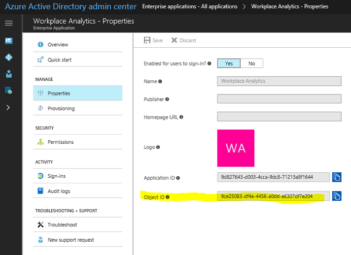
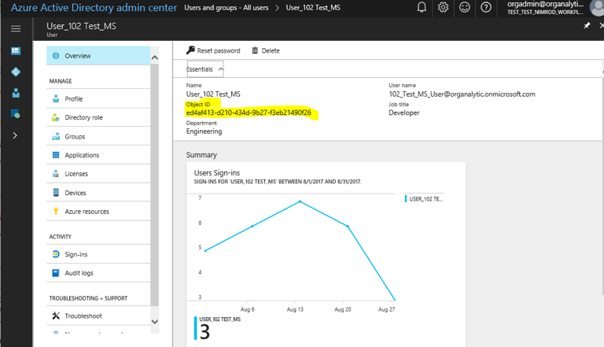
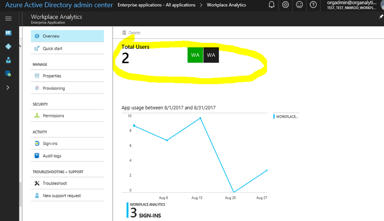
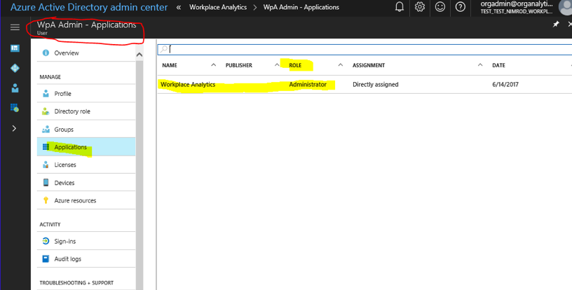

# Using PS to assign users to AAD App

## Installing AzureAD PowerShell module

1. Open an elevated Windows PowerShell command prompt.
2. Run the following command -> ***Install-Module -Name AzureAD***. If prompted to install a NuGet module or the new Azure Active Directory V2 PowerShell module, type Y and press ENTER.
3. Run the following command to connect to your Office 365 subscription -> ***Connect-AzureAD***. In the Azure Active Directory PowerShell dialog box, type your Office 365 work account user name and password, and then click Sign in. Follow the instructions in the Azure Active Directory PowerShell dialog box to provide additional authentication information, such as a verification code, and then click Sign in.

## Identifying the roles in Workplace Analytics App

1. In the Azure Active Directory admin center, identify the &lt;Object ID&gt; that corresponds to the Workplace Analytics App 
2. In the elevated Windows PowerShell command prompt that you opened above, run the following command -> $spo = Get-AzureADServicePrincipal -ObjectId &lt;Object ID&gt;.
3. Identify the roles by running the following command which will return all the available roles: -> $spo.AppRoles 
4. Get access to specific role.  You can see each role’s properties by checking the returned role.    
    - Program Manager:  * ** \-\> $programManagerRole = $spo.AppRoles \| Where\-Object \{$\_\.DisplayName \-eq \'Program Manager\'\} ** * 
    \- Administrator: ***\-> $adminRole = $spo.AppRoles | Where-Object {$_.DisplayName -eq 'Administrator'}*** 
    - Analyst Limited Access: ***-> $analystLimitedAccessRole = $spo.AppRoles | Where-Object {$_.DisplayName -eq 'Analyst (Limited Access)'}*** 
    - Analyst ***-> $analystRole = $spo.AppRoles | Where-Object {$_.DisplayName -eq 'Analyst'}*** 

## Assigning users to roles

1. In the Azure Active Directory admin center, identify the &lt;Object ID&gt; that corresponds to the user you want to assign to one of the roles 
2. In the elevated Windows PowerShell command prompt that you opened above, run the following command -> ***$user = Get-AzureADUser -ObjectId &lt;objectid&gt;***
3. Run the following command -> ***New-AzureADUserAppRoleAssignment -ObjectId $user.ObjectId -PrincipalId $user.ObjectId -ResourceId $spo.ObjectId -Id &lt;$roleVariable&gt;.Id***, where ***$roleVariable***  should correspond to the corresponding role variable you want to assign the user to. For example, if the user need to be assigned to Analyst role, then the command would be: ***-> New-AzureADUserAppRoleAssignment -ObjectId $user.ObjectId -PrincipalId $user.ObjectId -ResourceId $spo.ObjectId -Id  $analystRole.Id***

## Verifying user/s assignment to role/s

1. In the Azure Active Directory admin center, go to the Workplace Analytics App, you should see that Total Users equals the number of users you have assigned.  
2. Click on a user, then click on Applications. You should see an entry that shows the role you have assigned to the user in the Workplace Analytics App. 
